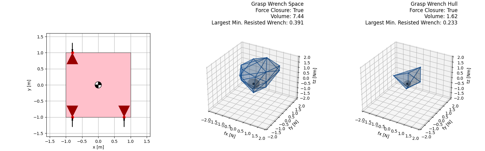
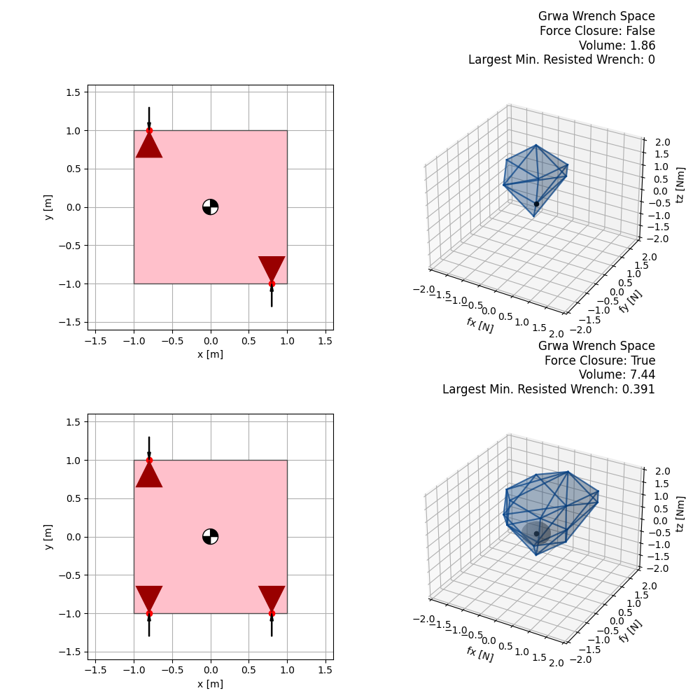
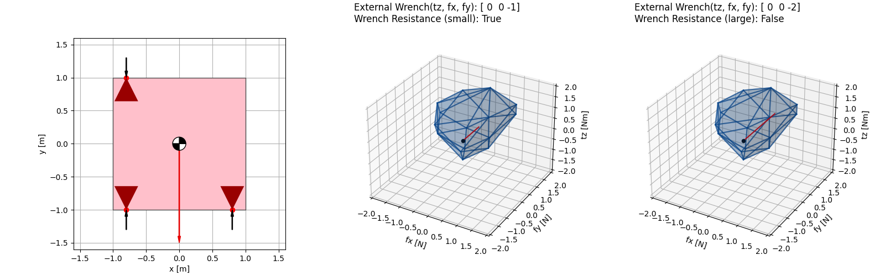
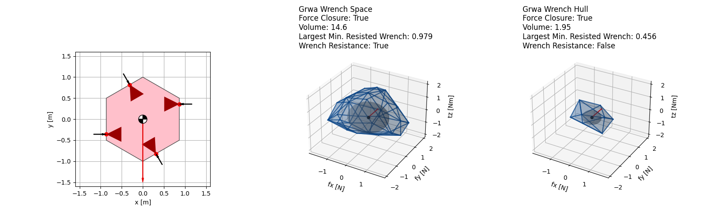

# Grasp Quality Measure for 2D Objects
This repository is part of the **Mathematics and Simulation for Robotics** course.  
It provides tools to evaluate grasp quality measures for 2D objects using concepts like grasp wrench space, force closure, and external wrench resistance.

## Table of Contents
1. [Tested Environment](#tested-environment)
2. [Installation](#installation)
3. [Examples](#examples)
   - [Example 1: Compare Grasp Wrench Space and Grasp Wrench Hull](#example-1---compare-grasp-wrench-space-and-grasp-wrench-hull)
   - [Example 2: Test Force Closure](#example-2---test-force-closure)
   - [Example 3: Test External Wrench Resistance](#example-3---test-external-wrench-resistance)
   - [Example 4: Random Object and Grasp Analysis](#example-4---grasp-wrench-space-with-random-object-and-grasp)


## Tested Environment

This code has been tested on the following environment:

- **OS**: Ubuntu 20.04
- **Python Version**: 3.8

Other environments may work but are not guaranteed. Please ensure compatibility before use.


## Installation
To set up the environment, ensure you have Python installed and run the following command to install the required dependencies:

```bash
pip install -r requirements.txt
```

## Examples
### Example 1 -  Compare Grasp Wrench Space and Grasp Wrench Hull
This script compares the grasp wrench space (GWS) with the grasp wrench hull (GWH) for a given 2D object.

Run the following command:
```bash
python ex1_gws_vs_gwh.py
```



### Example 2 - Test Force Closure
This script evaluates whether a grasp satisfies the force closure property, which is essential for a stable grasp.

Run the following command:
```bash
python ex2_force_closure.py
```



### Example 3 - Test External Wrench Resistance
This script tests the ability of a grasp to resist external wrenches applied to the object.

Run the following command:
```bash
python ex3_ext_wrench_resistance.py
```



### Example 4 - Grasp Wrench Space with Random Object and Grasp
This script generates a random 2D polygon and computes the grasp wrench space for randomly placed grasp points.

Run the following command:

```bash
python ex4_random_polygon.py
```


